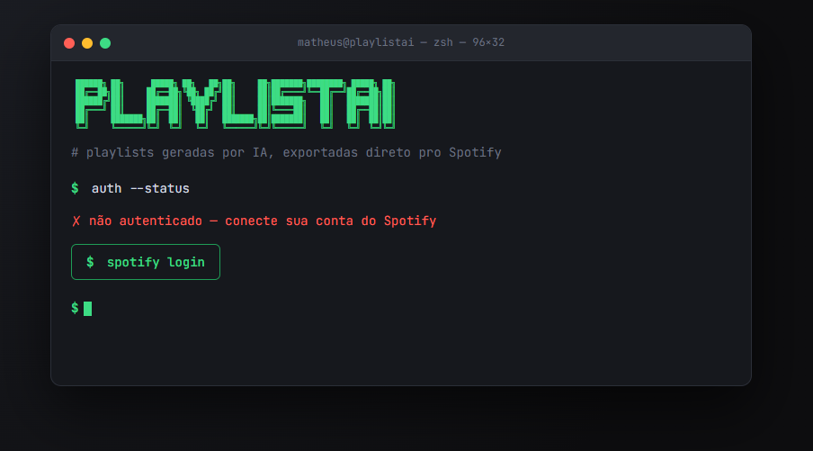
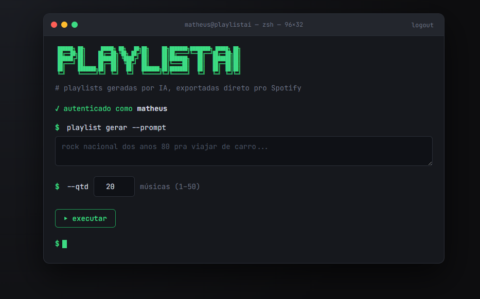

# PlaylistAi

Gere playlists no Spotify a partir de um prompt em linguagem natural. O app usa um modelo de IA via OpenRouter para sugerir musicas, busca as faixas no Spotify e cria a playlist diretamente na sua conta.


## Preview

Tela de login com Spotify:



Tela principal para gerar playlists:



## Funcionalidades

- Login com Spotify via OAuth.
- Geracao de sugestoes de musicas a partir de um prompt.
- Busca automatica das faixas no Spotify.
- Criacao da playlist na conta autenticada.
- Configuracao simples por variaveis de ambiente.

## Como funciona

1. Voce faz login com sua conta Spotify.
2. Digita um prompt, por exemplo: `rock nacional dos anos 80 pra viajar de carro`.
3. O OpenRouter retorna uma lista de musicas coerente com o pedido.
4. O servidor procura essas faixas no Spotify.
5. A playlist e criada automaticamente na sua conta.

## Tecnologias

- Node.js
- Express
- Express Session
- Spotify Web API
- OpenRouter API
- HTML, CSS e JavaScript puro no frontend

## Estrutura

```text
PlaylistAi/
|-- docs/               # Prints usados no README
|-- public/             # Frontend estatico
|   |-- app.js
|   |-- index.html
|   `-- styles.css
|-- src/
|   |-- ai.js           # Geracao das musicas via OpenRouter
|   `-- spotify.js      # OAuth, busca e criacao de playlist no Spotify
|-- .env.example        # Modelo das variaveis de ambiente
|-- package.json
`-- server.js           # Servidor Express e rotas da aplicacao
```

## Requisitos

- Node.js 18 ou superior
- Conta no Spotify
- App criado no Spotify Developer Dashboard
- Chave de API do OpenRouter

## Instalacao

Clone o repositorio e instale as dependencias:

```bash
npm install
```

Crie o arquivo `.env` a partir do exemplo:

```bash
cp .env.example .env
```

No Windows PowerShell:

```powershell
copy .env.example .env
```

Depois preencha as variaveis do `.env` e rode o projeto:

```bash
npm start
```

Para desenvolvimento, com reinicio automatico ao salvar:

```bash
npm run dev
```

Acesse:

```text
http://127.0.0.1:3000
```

## Variaveis de ambiente

```env
SPOTIFY_CLIENT_ID=
SPOTIFY_CLIENT_SECRET=
SPOTIFY_REDIRECT_URI=http://127.0.0.1:3000/callback

OPENROUTER_API_KEY=sk-or-...
OPENROUTER_MODEL=meta-llama/llama-3.3-70b-instruct:free

PORT=3000
SESSION_SECRET=troque_por_uma_string_aleatoria_longa
```

## Configurando o Spotify

1. Acesse [Spotify Developer Dashboard](https://developer.spotify.com/dashboard) e faca login.
2. Clique em **Create app**.
3. Preencha os dados basicos do app.
4. Em **Redirect URI**, adicione:

```text
http://127.0.0.1:3000/callback
```

5. Marque **Web API** em **Which API/SDKs are you planning to use?**.
6. Salve o app.
7. Abra **Settings** e copie:
   - **Client ID** para `SPOTIFY_CLIENT_ID`
   - **Client secret** para `SPOTIFY_CLIENT_SECRET`

O Redirect URI cadastrado no Spotify precisa ser exatamente igual ao valor de `SPOTIFY_REDIRECT_URI` no `.env`.

Por padrao, apps em modo de desenvolvimento permitem login apenas do dono do app e de usuarios adicionados em **User Management**.

## Configurando o OpenRouter

1. Acesse [OpenRouter](https://openrouter.ai) e faca login.
2. Va em [Keys](https://openrouter.ai/keys).
3. Clique em **Create Key**.
4. Copie a chave e cole em `OPENROUTER_API_KEY`.
5. Escolha um modelo gratuito em [OpenRouter Models](https://openrouter.ai/models?max_price=0).
6. Coloque o ID do modelo em `OPENROUTER_MODEL`.

Exemplo:

```env
OPENROUTER_MODEL=meta-llama/llama-3.3-70b-instruct:free
```

Modelos gratuitos geralmente terminam com `:free` e podem ter limite de requisicoes. Se um modelo ficar indisponivel, troque o valor de `OPENROUTER_MODEL` por outro modelo gratuito.

## Problemas comuns

| Erro | Causa provavel |
| --- | --- |
| `INVALID_CLIENT: Invalid redirect URI` | O Redirect URI do Spotify esta diferente do `.env`. |
| `state_invalido` no callback | Cookies bloqueados ou sessao expirada. Tente logar novamente. |
| Login falha para outra pessoa | Adicione o usuario em **User Management** no dashboard do Spotify. |
| `401` ao gerar playlist | Sessao do Spotify expirada. Faca login novamente. |
| `401` do OpenRouter | `OPENROUTER_API_KEY` invalida ou ausente. |
| `429` / rate limit | Limite do plano gratuito atingido. Aguarde ou troque o modelo. |
| `404` de modelo | ID em `OPENROUTER_MODEL` errado ou modelo indisponivel. |

## Licenca

Este projeto ainda nao possui uma licenca definida.
